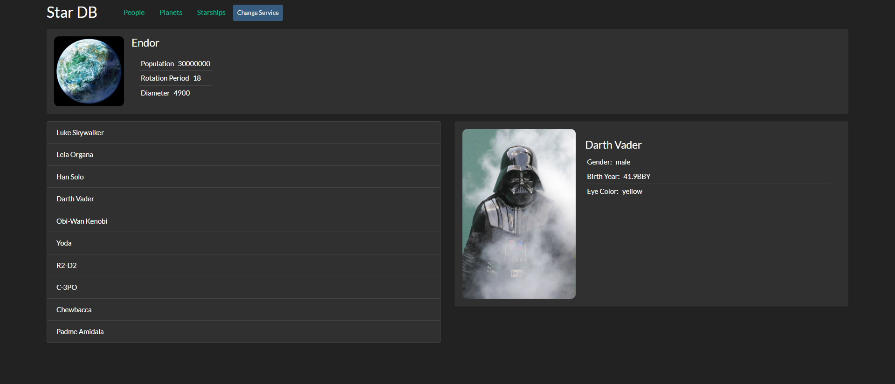

# Star Wars DB

## О проекте

Star Wars DB учебный React-проект по вселенной Star Wars. Репозиторий создавался в рамках практики по работе с API, компонентной архитектуре, маршрутизации, обработке ошибок и композиции компонентов через HOC.

Приложение отображает данные по персонажам, планетам и кораблям и строится вокруг отдельного сервисного слоя для загрузки и преобразования данных. Сейчас внешний API работает нестабильно или недоступен, поэтому проект сохраняется как учебный пример архитектуры и интерфейса с возможностью переключения на мок-данные.

## Demo

- Live demo: https://ganeevandrej.github.io/star_wars_db/

## Preview



## Стек

- React 18
- React Router DOM 6
- Axios
- Create React App
- ESLint

## Скрипты

```bash
npm install
npm start
npm run build
```

## Структура проекта

```text
star_wars_db/
 .github/workflows/      # Workflow для деплоя в GitHub Pages
 public/                 # Статические файлы приложения
 public/assets/          # Локальные изображения для моков
 src/components/         # UI-компоненты, страницы, HOC, boundary, списки и карточки
 src/services/           # Сервисный слой, API и мок-данные
 assets/                 # Исходная папка с локальными изображениями
 package.json
 README.md
```

## Чему посвящен проект

Проект посвящен практике работы с REST API, организации SPA-приложения на React, разделению UI и слоя данных, переиспользованию логики через HOC, маршрутизации, обработке загрузки и ошибок.
